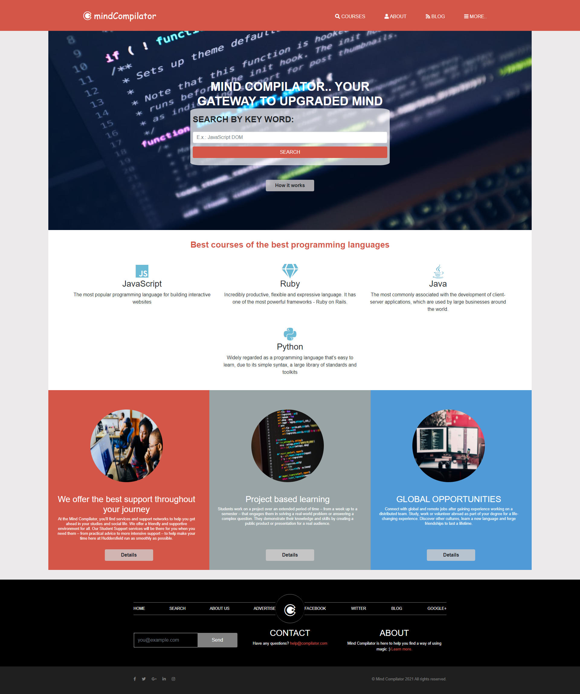
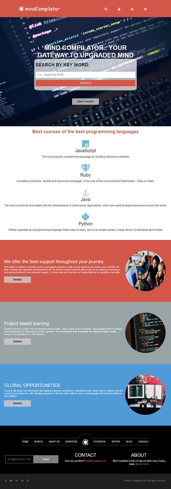
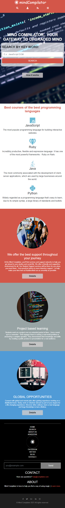
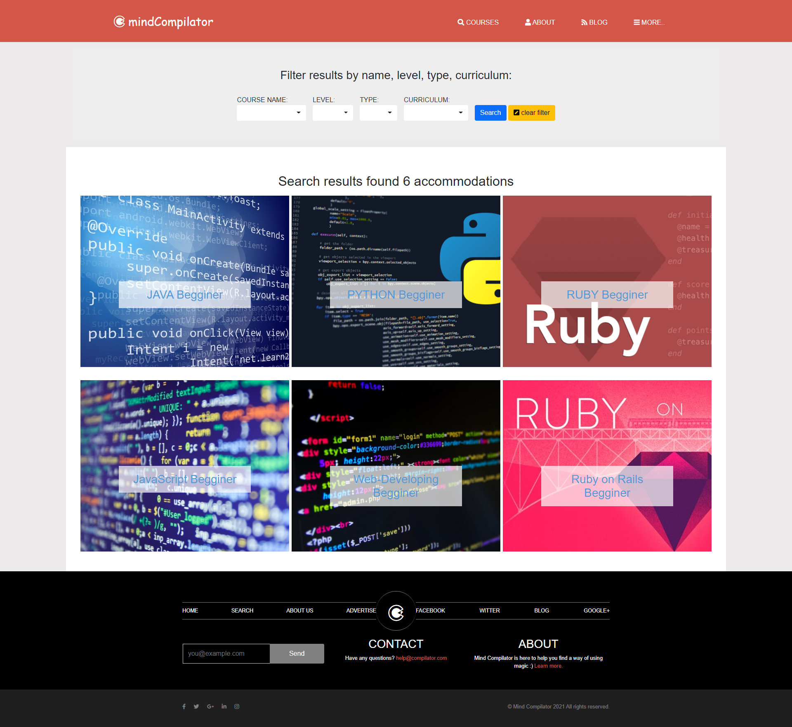
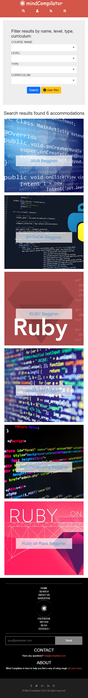
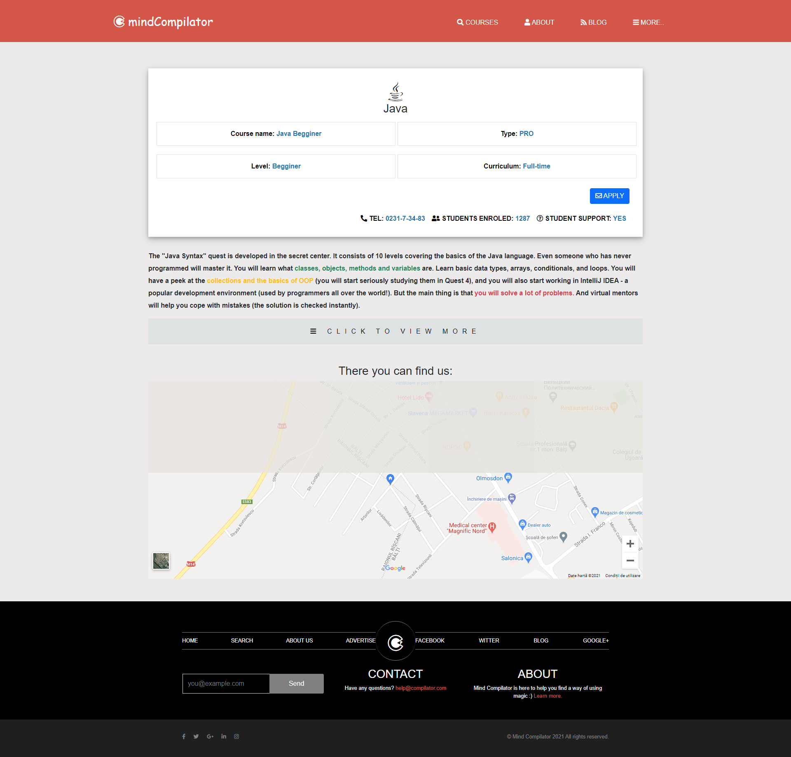
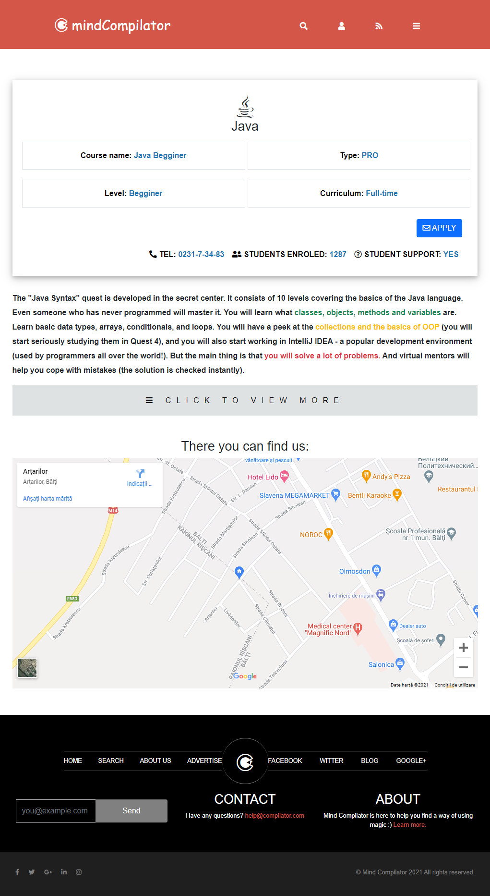
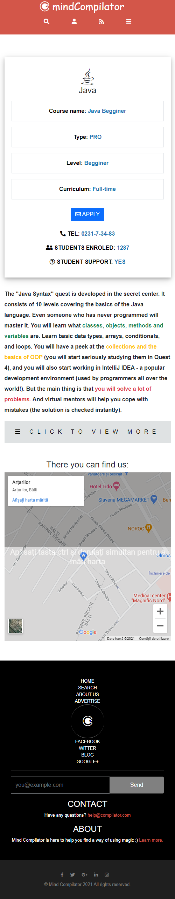

# Mind Compilator

I did this project for learning purposes as a capstone project from Microverse after completing HTML 2.0 curriculum.
The design is the same as [PatashuleKE](https://www.behance.net/gallery/25563385/PatashuleKE) by [Mathew Njuguna](https://www.behance.net/mathewnjuguna) which I have used for learning purposes with customized content (programming languages courses).

## Description

Mind Compilator is a web application that allows the study and improvement of programming languages. It helps to find the best learning content depending on the user's capabilities. 

At the moment it has three pages:
* main page with a searching bar, description and offers sections;
* result page with a filter bar and the results of filters;
* details page which contains detailed information about the user's choices.

## Built With

- HTML5;
- CSS3;
- Bootstrap 5.0;
- SASS.

## How it looks on different screens

### Main page:

| View on large screen | View on medium screen | View on small screen |
| --- | --- | --- |
|  |  |  |

### Results page:

| View on large screen | View on medium screen | View on small screen |
| --- | --- | --- |
|  |  |  |

### Details page:

| View on large screen | View on medium screen | View on small screen |
| --- | --- | --- |
|  |  |  |

## Live Demo

1. [Github](https://iliebabcenco.github.io/directory-of-courses/)
2. [Netlify](https://mind-compilator.netlify.app/)

## Getting Started

**This is an example of how you may give instructions on setting up your project locally.**
**Modify this file to match your project, remove sections that don't apply. For example: delete the testing section if the currect project doesn't require testing.**

### Usage

To get a local copy up and running follow these simple example steps.
1. Clone it on your local computer by running git clone git@github.com:iliebabcenco/directory-of-courses.git;
2. Fork this repository.

### Run tests

The project passed all Webhint and Stylelint tests.

For this purpose you can run:

* npx hint .
* npx stylelint "**/*.{css,scss}"

### Deployment

This web application is deploied on Netlify [live](https://mind-compilator.netlify.app/).

## Authors

👤 **Ilie Babcenco**

- GitHub: [@iliebabcenco](https://github.com/iliebabcenco)
- LinkedIn: [@iliebabcenco](https://www.linkedin.com/in/ilie-babcenco-72459a1b1/)
- Twitter: [@iliebabcenco](https://twitter.com/BabcencoIlie)

## 🤝 Contributing

Contributions, issues, and feature requests are welcome!

If you want to contribute, you can clone this project or fork it.

If you found an issue, feel free to check the [issues page](https://github.com/iliebabcenco/directory-of-courses/issues).

## Show your support

Give a ⭐️ if you like this project!

## Acknowledgments

* [Microverse](https://www.microverse.org/)
* [Mathew Njuguna](https://www.behance.net/mathewnjuguna)
