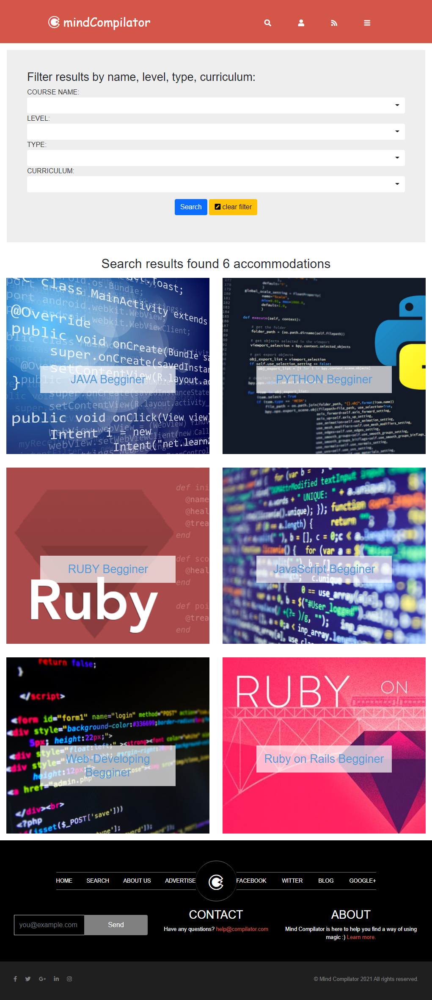

# Mind Compilator

I did this project in learning purposes as a capstone project from Microverse after completing HTML 2.0 curriculum.
The design is the same of [PatashuleKE](https://www.behance.net/gallery/25563385/PatashuleKE) by [Mathew Njuguna](https://www.behance.net/mathewnjuguna) which I have used for learning purposes with customized content (programming languages courses).

## Description

Mind Compilator is a web application which allows study and improvement of programming languages. It helps to find the best learning content depending on the user's capabilities. 

At the moment it has three pages:
* main page with a searching bar, description and offers sections;
* result page with a filter bar and the results of filters;
* details page which contains detailed information about the user's choiche.

## Built With

- HTML5;
- CSS3;
- Bootstrap 5.0;
- SASS.

## How it looks on different screens

### Main page:

| View on large screen | View on medium screen | View on small screen |
| --- | --- | --- |
|  |  |  |

### Results page:

| View on large screen | View on medium screen | View on small screen |
| --- | --- | --- |
|  |  |  |

### Details page:

| View on large screen | View on medium screen | View on small screen |
| --- | --- | --- |
|  |  |  |

## Live Demo

1. [Github](https://iliebabcenco.github.io/directory-of-courses/)
2. [Netlify](https://mind-compilator.netlify.app/)

## Getting Started

**This is an example of how you may give instructions on setting up your project locally.**
**Modify this file to match your project, remove sections that don't apply. For example: delete the testing section if the currect project doesn't require testing.**

To get a local copy up and running follow these simple example steps.

### Prerequisites

### Setup

### Install

### Usage

### Run tests

### Deployment

This web application is deploied on Netlify [live](https://mind-compilator.netlify.app/).

## Authors

👤 **Author1**

- GitHub: [@githubhandle](https://github.com/githubhandle)
- Twitter: [@twitterhandle](https://twitter.com/twitterhandle)
- LinkedIn: [LinkedIn](https://linkedin.com/linkedinhandle)

👤 **Author2**

- GitHub: [@githubhandle](https://github.com/githubhandle)
- Twitter: [@twitterhandle](https://twitter.com/twitterhandle)
- LinkedIn: [LinkedIn](https://linkedin.com/linkedinhandle)

## 🤝 Contributing

Contributions, issues, and feature requests are welcome!

Feel free to check the [issues page](issues/).

## Show your support

Give a ⭐️ if you like this project!

## Acknowledgments

- Hat tip to anyone whose code was used
- Inspiration
- etc

## 📝 License

This project is [MIT](lic.url) licensed.
